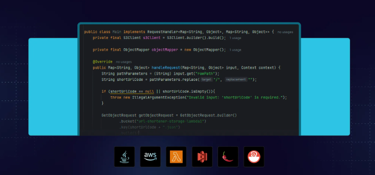

    

<h1 align="center">url-shortner-lambda-aws</h1>

*url-shortner-lambda-aws* é um projeto que utiliza função lambda AWS como ponte de criação para encurtamentos de URLs.

## Sobre o projeto

Um serviço de encurtamento de URL serverless criado com o AWS, usando Lambda, API Gateway e S3. Este projeto mostra como criar aplicações escaláveis e econômicas com tecnologias nativas da nuvem com serviços AWS. Desenvolvido durante um evento Rocketseat gratuito, proporcionando experiência prática em arquitetura sem servidor.

## Ferramentas

Neste projeto, foram utilizadas as seguintes ferramentas:

- Java
- AWS
- Lambdas
- S3

## Atividades

- [x] Lesson 1
- [x] Lesson 2
- [x] Lesson 3 [Repositório função lambda de redirecionamento](https://github.com/Matheus153/url-redirect-lambda-aws.git)

## Autor

### Matheus Santos

